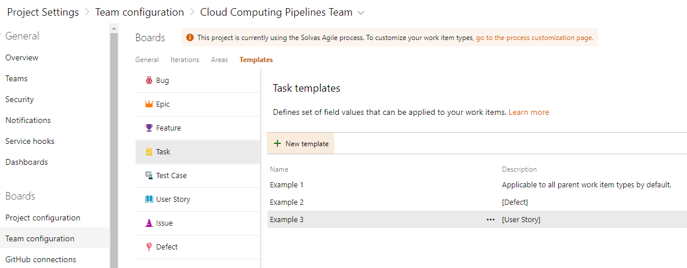

# Calculating Task Values Automatically with Field Expressions

*A guide to the new `=` expression feature in Linked Tasks Automation*

**Last updated**: 2026-08-30 · **Applies to**: Linked Tasks Automation v1.3.0

---

## Table of Contents

1. [What Is This Feature?](#what-is-this-feature)
2. [Who Should Use This?](#who-should-use-this)
3. [Before You Start: A Quick Refresher on Special Field Values](#before-you-start-a-quick-refresher-on-special-field-values)
4. [Getting Started: Where to Write a Formula](#getting-started-where-to-write-a-formula)
5. [How to Write a Formula](#how-to-write-a-formula)
6. [Worked Examples](#worked-examples)
7. [What Symbols and Functions Can I Use?](#what-symbols-and-functions-can-i-use)
8. [Pulling In Values from the Parent Work Item](#pulling-in-values-from-the-parent-work-item)
9. [What Happens If a Formula Can't Be Calculated?](#what-happens-if-a-formula-cant-be-calculated)
10. [Tips and Best Practices](#tips-and-best-practices)
11. [What If...? (Troubleshooting)](#what-if-troubleshooting)
12. [Related Features](#related-features)

---

## What Is This Feature?

When Linked Tasks Automation creates child tasks from your templates, most field values are either typed in directly, copied from the parent work item, or left blank so the child inherits the parent's value.

Now you can also tell a field to **calculate its own value** using a simple formula, based on numbers from the parent work item. For example, instead of manually deciding how many Story Points each generated task should have, you can write a formula once in the template — such as "twice the parent's Story Points, rounded up" — and every task created from that template gets the right number automatically, every time.

This is useful for breakdowns where child tasks should scale with the parent, like splitting a user story's effort across a fixed set of tasks, or setting a sub-task's estimate as a percentage of the parent's.

## Who Should Use This?

This feature is for **template authors** — team members with permission to manage work item templates (usually team administrators or leads who set up the task breakdown your team uses). If you're the person who edits the templates under **Team Settings > Work Item Types**, this guide is for you.

You do **not** need to know any programming to use this. If you can write a simple math formula like `2.5 * 2`, you already know everything you need.

## Before You Start: A Quick Refresher on Special Field Values

Linked Tasks Automation already supports a few special ways to fill in a template field. Expressions are simply a new addition to this list:

| What you type in the field | What happens |
|---|---|
| *(leave it empty)* | The child task inherits the parent's value for that field |
| `@me` | The child task is assigned to you |
| `@currentiteration` | The child task is set to the team's current iteration (sprint) |
| `Fix for {System.Title}` | The text `{System.Title}` is replaced with the parent's title, e.g. "Fix for Login page crashes" |
| `=Math.ceil({Microsoft.VSTS.Scheduling.StoryPoints}*2)` | **New** — the value is calculated from a formula (this guide) |

The curly-brace syntax `{Field.Reference.Name}` you see above — for pulling in a parent's value as text — already existed. Expressions reuse the exact same syntax, but instead of pasting text, they do math with the number.

## Getting Started: Where to Write a Formula

Formulas are typed directly into the same field value box you already use for templates — there's no new screen, button, or setting to turn on. Everything happens in the template editor you already know.

1. Open your project's task template list at **Team Settings > Work Item Types**, and open the child template you want to edit.

   

   💡 **Tip**: This is standard Azure DevOps functionality, not part of the extension — Linked Tasks Automation reads whatever you save here.

2. Click into the value box of the field you want to calculate (for example, "Story Points" or "Effort"). It's a plain text box, just like any other template field.

3. Type your formula, starting with an equals sign (`=`). See [How to Write a Formula](#how-to-write-a-formula) below.

4. Save the template.

That's it — the next time someone clicks **Create linked tasks** on a parent work item, this template's field is calculated automatically.

## How to Write a Formula

A field value is treated as a formula whenever the **first character you type is `=`** (extra spaces before or after it are fine). Everything after the `=` is the formula itself.

📝 **Requirement**: There's no way to make a field's value literally start with the character `=` — if your first character is `=`, it will always be read as a formula. If you need a literal `=` in a text field, put something before it (e.g. a space won't work, but rewording the value will).

A formula can contain:

- **Numbers**, including decimals: `2`, `0.5`, `.5`
- **Basic math**: add (`+`), subtract (`-`), multiply (`*`), divide (`/`), and remainder (`%`)
- **Parentheses** `( )` to control order of operations, just like in a calculator
- **A minus sign in front of a number** to make it negative, e.g. `-3`
- **Curly-brace placeholders** like `{Microsoft.VSTS.Scheduling.StoryPoints}` to pull in a number from the parent work item — see [Pulling In Values from the Parent Work Item](#pulling-in-values-from-the-parent-work-item)
- **A small set of rounding and comparison helpers**: `Math.ceil`, `Math.floor`, `Math.round`, `Math.abs`, `Math.min`, `Math.max`, `Math.pow` — see the table below

Formulas follow the same order of operations you learned in school: anything in parentheses first, then multiply/divide/remainder, then add/subtract.

✅ **What you should see**: after you save the template and someone creates tasks from it, the calculated field on the new child task already has the correct number filled in — no manual editing needed.

## Worked Examples

Here are some real formulas you might use, and what they do:

| Formula | What it calculates | Example result |
|---|---|---|
| `=Math.ceil({Microsoft.VSTS.Scheduling.StoryPoints}*2)` | Twice the parent's Story Points, rounded **up** to a whole number | Parent has 2.5 Story Points → child gets **5** |
| `={Microsoft.VSTS.Scheduling.Effort}/2` | Half the parent's Effort | Parent has 8 Effort → child gets **4** |
| `=Math.max({Microsoft.VSTS.Scheduling.StoryPoints}-1, 1)` | The parent's Story Points minus one, but never less than 1 | Parent has 1 Story Point → child gets **1** (not 0) |
| `=Math.round({Microsoft.VSTS.Scheduling.StoryPoints}*0.3)` | 30% of the parent's Story Points, rounded to the nearest whole number | Parent has 8 Story Points → child gets **2** (2.4 rounds down) |

💡 **Tip**: Start with one of these examples and adjust the numbers to match how your team wants to split work — you don't need to write a formula from scratch.

## What Symbols and Functions Can I Use?

### Math operators

| Symbol | Meaning | Example |
|---|---|---|
| `+` | Add | `2+3` → 5 |
| `-` | Subtract (or make a number negative) | `10-4` → 6, `-3` → -3 |
| `*` | Multiply | `2*3` → 6 |
| `/` | Divide | `10/4` → 2.5 |
| `%` | Remainder ("what's left over") | `7%3` → 1 |
| `( )` | Group part of the formula to calculate it first | `(1+2)*3` → 9 |

### Rounding and comparison functions

These all start with `Math.` and are typed with parentheses around the number(s) they work on:

| Function | What it does | Example |
|---|---|---|
| `Math.ceil(x)` | Rounds a number **up** | `Math.ceil(1.2)` → 2 |
| `Math.floor(x)` | Rounds a number **down** | `Math.floor(1.8)` → 1 |
| `Math.round(x)` | Rounds to the nearest whole number | `Math.round(2.5)` → 3 |
| `Math.abs(x)` | Removes a minus sign (absolute value) | `Math.abs(-4)` → 4 |
| `Math.min(a, b, ...)` | The smallest of the numbers given | `Math.min(3, 1, 2)` → 1 |
| `Math.max(a, b, ...)` | The largest of the numbers given | `Math.max(3, 1, 2)` → 3 |
| `Math.pow(x, y)` | `x` raised to the power of `y` | `Math.pow(2, 10)` → 1024 |

⚠️ **What's not supported**: only the operators and functions listed above work. Text/words, dates, comparisons like "greater than", and any `Math.` function not in this table (for example `Math.sqrt`) are not allowed and will cause the field to be skipped — see the next section.

## Pulling In Values from the Parent Work Item

Wrap a field's reference name in curly braces, e.g. `{Microsoft.VSTS.Scheduling.StoryPoints}`, and it's replaced with that field's number from the **parent** work item before the formula is calculated. You can use the same placeholder more than once in one formula, e.g. `={Microsoft.VSTS.Scheduling.StoryPoints}+{Microsoft.VSTS.Scheduling.StoryPoints}`.

Some commonly used field reference names:

| Field | Reference name to use in `{ }` |
|---|---|
| Story Points | `Microsoft.VSTS.Scheduling.StoryPoints` |
| Effort | `Microsoft.VSTS.Scheduling.Effort` |
| Original Estimate | `Microsoft.VSTS.Scheduling.OriginalEstimate` |
| Priority | `Microsoft.VSTS.Common.Priority` |
| Business Value | `Microsoft.VSTS.Common.BusinessValue` |

📝 **Note**: You can find any field's exact reference name via the field's "..." menu in the work item form (**Copy field name/value**), or by asking a project administrator.

⚠️ **Important — the parent field must be a number**: the field you reference has to contain a number, or text that's purely a number (like `"3"`). If the parent's field is empty, unset, or contains something that isn't a number (a name, a date, rich text, etc.), the formula can't be calculated and that field is skipped on the child task — see below.

⚠️ **Whole-number fields need rounding**: some Azure DevOps fields — Priority and Business Value are common examples — only accept whole numbers. If your formula could produce a fraction (like `{Microsoft.VSTS.Common.Priority}/2` when Priority is 3, giving 1.5), Azure DevOps will reject the value and the whole task creation for that template will fail. Wrap the formula in `Math.round(...)`, `Math.ceil(...)` or `Math.floor(...)` to guarantee a whole number, e.g. `=Math.round({Microsoft.VSTS.Common.Priority}/2)`.

## What Happens If a Formula Can't Be Calculated?

Mistakes happen — a typo in a function name, a formula referencing a field the parent doesn't have, or a parent field that's empty. Linked Tasks Automation is designed so that **one broken formula never stops your task from being created**.

Here's what you'll see:

✅ **The task is still created.** Every other field on that task — including fields with correct formulas — is filled in normally. Only the field with the broken formula is left out.

✅ **The completion message tells you something was skipped.** After tasks are created, the summary dialog shows a line like:

> `Work item #123: 3 tasks of 3 templates created. Warnings: Task A (1 field skipped), Task B (2 fields skipped)`

If a template also fails outright (see the note below) alongside warnings on another template, you'll see both in the same line:

> `Work item #123: 2 tasks of 3 templates created. Failed: Task C. Warnings: Task A (1 field skipped)`

If nothing was skipped or failed, the message looks exactly as it always has, with no `Warnings:` text at all:

> `Work item #123: 3 tasks of 3 templates created`

The `Warnings:` text names the **template** and how many fields it skipped, so you know which template to go back and fix. It doesn't list which field or why — for that level of detail, see below.

📝 **For the exact reason**: open your browser's developer console (press **F12**, then the "Console" tab) — every skipped field logs a line starting with `linked-tasks-automation:` explaining which template, which field, and why the formula couldn't be calculated (for example, an empty parent field, an unrecognized function name, or a formula that doesn't add up).

⚠️ **One exception — required fields**: a small number of fields are required by Azure DevOps for a work item to be created at all (Title is the most common example). If a formula on one of *these* fields fails, there's no fallback value to use, so Azure DevOps rejects the whole task, and that template shows up as **Failed** instead of **Warnings**. The console still shows the same detailed error, which is the best place to start fixing it.

## Tips and Best Practices

💡 **Test with one field first.** When adding your first formula, try it on a single non-critical field (like Story Points) before rolling formulas out across a whole template.

💡 **Round whole-number fields.** Always wrap formulas that feed into Priority, Business Value, or other whole-number-only fields with `Math.round`, `Math.ceil`, or `Math.floor` — see [Pulling In Values from the Parent Work Item](#pulling-in-values-from-the-parent-work-item).

💡 **Clear the cache after editing a template.** Templates are cached in your browser for up to 4 hours for faster performance. If you edit a template and immediately test it but don't see your changes, clear the browser's site data for keys starting with `linkedTasksAutomation.templateCache.` (in developer tools, under Application/Storage), or simply wait — the cache refreshes automatically after 4 hours.

💡 **Check the completion message every time you test.** A quiet "3 tasks of 3 templates created" with no `Warnings:` text is your confirmation that every formula in your templates calculated successfully.

## What If...? (Troubleshooting)

**What if my child task is missing a field I expected to be calculated?**
Check the completion dialog for a `Warnings:` entry naming that template, then open the browser console (F12) for the exact reason. The most common causes are a typo in a function name (`Math.ciel` instead of `Math.ceil`) or a parent field that's empty.

**What if a whole task didn't get created at all?**
Look for `Failed: <template name>` in the completion dialog. This usually means a formula failed on a field that Azure DevOps requires (most often Title), or the calculated value didn't fit the field's rules (for example, a fraction going into a whole-number-only field). Check the console for the detailed reason and fix the formula or add rounding.

**What if I want a field to always show a literal `=` character at the start?**
This isn't supported today — any value starting with `=` is always read as a formula. Reword the value so it doesn't need to start with `=`.

**What if I'm not sure what a parent field's reference name is?**
Open the parent work item, find the field, use its "..." menu and choose **Copy field name/value**, or check with your project administrator.

**What if my formula uses something not in the supported list (like `Math.sqrt`, `>`, or plain text)?**
It isn't supported — see [What Symbols and Functions Can I Use?](#what-symbols-and-functions-can-i-use) for the full list. The field will be skipped and the console will explain exactly what wasn't recognized.

## Related Features

- **Placeholders** (`{Field.Reference.Name}` in plain text) — the same syntax expressions use to pull in parent values, but for inserting text rather than doing math.
- **`@me` and `@currentiteration`** — quick shortcuts for assignee and iteration fields.
- **Filtering templates** (`applywhen` / `notapplywhen`) — control which parent work items a template applies to.
- **`linkTo` rules** — control which other tasks a newly created task links to.

For the full technical reference (including the complete grammar and every supported function), see the **Field values: placeholders and expressions** section of the extension's [overview page](../../../../../src/overview.md).
