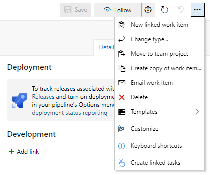
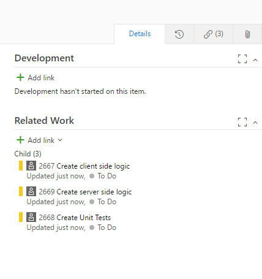

## Linked Tasks Automation ##

<a href="https://marketplace.visualstudio.com/items?itemName=SyczMariusz.vsts-work-item-linked-tasks-automation" target="_blank">Linked Tasks Automation</a> is an Azure DevOps extension for creating multiple work items as children via a single click, where each child work item is based on a pre-defined template.

Azure DevOps offers team-specific work item templating as <a href="https://docs.microsoft.com/en-us/azure/devops/boards/backlogs/work-item-template?view=azure-devops&tabs=browser" target="_blank">core functionality</a> with which you can quickly apply pre-populated values for your team's commonly used fields per work item type.

The child work items created by this extension are based on the hierarchy of work item types defined in the process template (<a href="https://docs.microsoft.com/en-us/azure/devops/boards/work-items/guidance/agile-process-workflow?view=azure-devops" target="_blank">Agile</a>, <a href="https://docs.microsoft.com/en-us/azure/devops/boards/work-items/guidance/scrum-process-workflow?view=azure-devops" target="_blank">Scrum</a>, <a href="https://docs.microsoft.com/en-us/azure/devops/boards/work-items/guidance/cmmi-process-workflow?view=azure-devops" target="_blank">CMMI</a>).

For example, if you're using a process inherited from the agile template with a custom requirement-level type called defect and 3 task templates defined, clicking "Create linked tasks" on a user story or defect will generate three child tasks, one for each defined template.

## What's New ##

The extension was rewritten from a single 629-line JavaScript file into a modular TypeScript codebase (`src/scripts/`, 15 focused files), which made it possible to add:

* **Faster repeat runs** — templates, team settings, and work item type categories are cached in the browser (`localStorage`, 4-hour TTL), so a second "Create linked tasks" invocation in the same session skips those REST round trips entirely.
* **Concurrent child creation** — templates whose `linkTo` rules don't depend on other just-created tasks are created in parallel instead of one at a time; only templates that genuinely depend on ordering (see [linkTo rules](#linkto-rules) below) stay sequential.
* **Reliable creation on popup close** — create and link requests now use `fetch(..., { keepalive: true })` instead of the SDK's wrapped REST client, so work already dispatched keeps running server-side even if you close the work-item popup right after clicking.
* **Visible progress** — a "Starting task creation..." notice appears immediately after clicking, and a completion summary reports how many tasks were created (and which templates failed, if any) once processing finishes — per work item, if you triggered it from more than one.

## Filtering templates ##

It's possible to limit which parent work items a template applies to, in one of two ways:

Simplified: put the list of applicable parent work item types in the child template's description field, like this: `[Product Backlog Item,Defect]`

Complex: put a minified (single line) JSON string into the child template's description field, like this:

``` json
{
    "applywhen":
    {
        "System.State": "Approved",
        "System.Tags" : ["Blah", "ClickMe"],
        "System.WorkItemType": "Product Backlog Item"
    },
    "notapplywhen":
    {
        "System.Tags" : ["DoNotAutomate"]
    },
    "linkTo":["ToAllOtherChilds", "ToAllJustCreatedTasks", "PreviouslyJustCreatedTask", "SecondPreviouslyJustCreatedTask", "FirstJustCreatedTask", "SecondJustCreatedTask"]
}
```

* `applywhen` — the template is only used when the parent work item matches these field values (omit to always apply).
* `notapplywhen` — the template is skipped when the parent work item matches these field values, even if `applywhen` matched (omit to never skip).

### linkTo rules ###

`linkTo` controls which other work items the newly created task gets linked to, in addition to its parent:

| Rule | Links the new task to |
|---|---|
| `ToAllOtherChilds` | Every existing child of the parent work item |
| `ToAllJustCreatedTasks` | Every task already created during this run |
| `PreviouslyCreatedTask` / `PreviouslyJustCreatedTask` | The task created immediately before this one |
| `SecondPreviouslyJustCreatedTask` | The task created two before this one |
| `FirstJustCreatedTask` | The very first task created during this run |
| `SecondJustCreatedTask` | The second task created during this run |

Templates using any of the rules above (except `ToAllOtherChilds`) are created one at a time, in alphabetical order by template name, so that "previous"/"first"/"second" resolve predictably. Templates without such a rule create concurrently for speed.

### Define team templates ###

<a href="https://docs.microsoft.com/en-us/azure/devops/boards/backlogs/work-item-template?view=azure-devops&tabs=browser#manage" target="_blank">Manage work item templates</a>


### Create / open a work item ###

Find "Create linked tasks" on the work item toolbar menu



### Done ###

You should now have children associated with the open work item.



## Project Structure ##

The extension is a stateless, backend-less browser extension — all logic runs client-side against the Azure DevOps REST APIs. Source lives under `src/scripts/`:

| File | Responsibility |
|---|---|
| `app.ts` | Entry point — `create(context)`, called by `toolbar.html` |
| `orchestrator.ts` | Coordinates one "create linked tasks" run: parallel reads, template classification, dispatch, progress dialogs |
| `templateCache.ts` | `localStorage`-backed cache (templates, team settings, work item type categories) |
| `keepaliveFetchClient.ts` | `fetch(keepalive:true)` transport for create/link REST calls |
| `authTokenProvider.ts` | Wraps `VSS.getAccessToken()` for the keepalive client |
| `progressDialogController.ts` | Start/completion notification dialogs |
| `templateClassifier.ts` | Splits templates into concurrent vs. sequential based on their `linkTo` rules |
| `workItemCreation.ts` | Builds and sends the create/link requests, including all `linkTo` branches |
| `templateBuilder.ts` | Builds a new work item's field set from its template and the parent |
| `templateFilters.ts` | `applywhen`/`notapplywhen` matching and template-description JSON parsing |
| `childTypes.ts` | Resolves which child work item types apply to the parent's type |
| `templates.ts` | Fetches (and caches) team templates |
| `context.ts`, `types.ts`, `logging.ts` | Shared web context, type aliases, and logging helpers |

## Usage ##

1. Clone the repository
2. `cd src && npm install` to install required local dependencies
3. `npm run build` (or `npx grunt build`) to compile TypeScript and assemble the extension under `build/`

### Grunt tasks (run from `src/`) ###

* `npm run build` / `npx grunt build` - Compiles TypeScript and copies static assets to `build/`
* `npx grunt package-dev` - Builds the development version of the `.vsix` package
* `npx grunt package-release` - Builds the release version of the `.vsix` package
* `npx grunt publish-dev` - Publishes the development version of the extension to the Marketplace using `tfx-cli`
* `npx grunt publish-release` - Publishes the release version of the extension to the Marketplace using `tfx-cli`
* `npm run serve` / `npx grunt serve` - Builds and starts a local HTTPS server (`https://localhost:5501`) for debugging

Note: To avoid `tfx` prompting for your token when publishing, log in beforehand using `tfx login` and the service uri of `https://marketplace.visualstudio.com`.

### Debugging your extension ###

`npm run serve` builds the extension and serves it locally over HTTPS at `https://localhost:5501` (a self-signed certificate is generated automatically on first run via `npm run generate-cert`). To load your local build instead of the published one, add a `baseUri` property to `src/vss-extension.json` (or to `src/configs/dev.json`, which overrides it for `package-dev`/`publish-dev` builds):

``` json
{

    "baseUri": "https://localhost:5501",

}
```

There is no automated test suite yet; changes are verified manually against a live Azure DevOps org.

